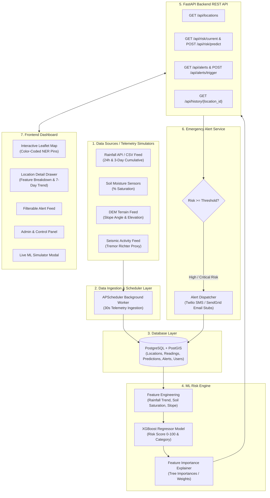
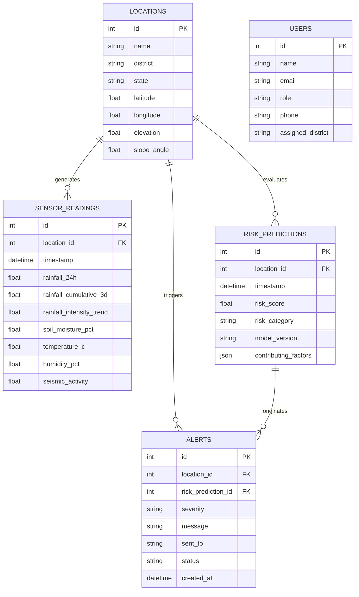

# SIH26001: AI-Based Landslide Risk Monitoring System (NER)

**Smart India Hackathon 2026 Prototype**  
**Problem Statement:** SIH26001 – AI-Based Landslide Risk Monitoring System in North Eastern Region (NER) of India

---

## 1. Problem Summary & Overview

The North Eastern Region (NER) of India—comprising Meghalaya, Sikkim, Arunachal Pradesh, Mizoram, Nagaland, Manipur, Tripura, and hilly regions of Assam—is highly vulnerable to fatal rainfall-induced landslides due to steep topography, active tectonic fault zones, and heavy monsoon downpours. Existing disaster response mechanisms are largely reactive. 

**SIH26001** presents an end-to-end AI-driven early warning platform that ingests real-time precipitation, 3-day cumulative rainfall soaking, soil moisture saturation, slope angle, elevation, and seismic tremor activity across monitored locations in NER. An XGBoost Machine Learning model computes continuous landslide risk scores (0–100) and risk categories (`Low`, `Moderate`, `High`, `Critical`), explaining feature importance drivers for disaster management authorities and dispatching emergency alerts to mitigate loss of life.

---

## 2. System Architecture



---

## 3. Data Flow Explanation

1. **Ingestion & Telemetry Collection**: Weather, soil moisture, slope, and seismic parameters for 25 NER monitoring stations (e.g. Shillong, Cherrapunji, Gangtok, Mangan, Aizawl, Tawang, Kohima) are collected periodically by background ingestion workers.
2. **Feature Computation**: Features including 24h rainfall (`rainfall_24h`), 3-day cumulative rainfall (`rainfall_cumulative_3d`), storm intensity trend (`rainfall_intensity_trend`), soil saturation percentage (`soil_moisture_pct`), slope angle (`slope_angle`), elevation, and seismic activity are compiled.
3. **Database Audit**: Telemetry records are saved in PostgreSQL for time-series reporting.
4. **ML Inference Engine**: The pre-trained XGBoost Regressor model processes features, yielding:
   - Continuous Landslide Risk Score ($0 - 100$)
   - Categorical Risk Designation (`Low`: 0-25, `Moderate`: 26-50, `High`: 51-75, `Critical`: 76-100)
   - Relative feature weights (e.g. Soil Moisture Saturation 45.8%, Slope Angle 18.1%, 3D Cumulative Rain 14.1%)
5. **Threshold Evaluation & Alerting**: If risk evaluates to `High` or `Critical`, an automated alert record is generated in DB and dispatched via SMS/Email notification stubs to disaster authorities.
6. **Dashboard Visualization**: React frontend fetches `/api/risk/current` every 15s to update map markers, detail drawers, and summary metric cards in real time.

---

## 4. Tech Stack & Justification

| Component | Technology Used | Justification & Role |
| :--- | :--- | :--- |
| **Database** | PostgreSQL + PostGIS | Enterprise-grade relational store with PostGIS geospatial indexing for location queries and historical time-series indexing. |
| **Backend API** | Python + FastAPI + SQLAlchemy | Async high-performance framework auto-generating OpenAPI documentation (`/docs`), paired with SQLAlchemy ORM. |
| **Machine Learning** | XGBoost + Scikit-Learn | Tree-boosting algorithm providing high regression accuracy ($R^2 = 0.9708$, RMSE = 2.8158) and inherent feature importance explainability. |
| **Frontend** | React 18 + TypeScript + Vite | Type-safe, modular SPA framework delivering fast rendering and seamless state updates. |
| **Interactive Map** | Leaflet JS (React-Leaflet) | Lightweight geospatial mapping library configured with CartoDB Dark Matter tiles and color-coded risk markers. |
| **Data Viz** | Recharts | Responsive charting library rendering feature importance bar graphs and 7-day precipitation time-series trend lines. |
| **Styling** | Tailwind CSS | Utility-first styling framework enabling a sleek, dark-mode disaster command center dashboard layout. |
| **Task Scheduling** | APScheduler | Background job runner handling 30-second telemetry polling and risk recalculations inside FastAPI lifespan. |
| **Containerization** | Docker + Docker Compose | Multi-container composition orchestrating PostgreSQL, FastAPI backend, and Nginx frontend services. |

---

## 5. Database Entity-Relationship (ER) Diagram



---

## 6. Setup & Execution Instructions

### Option A: Docker Compose (Recommended)

1. Clone repository and navigate to root directory:
   ```bash
   git clone <repo-url>
   cd landslide-risk-ner
   ```

2. Start all services using Docker Compose:
   ```bash
   docker-compose up --build
   ```

3. Access applications:
   - **Frontend Dashboard**: `http://localhost:3000`
   - **FastAPI Backend Swagger Docs**: `http://localhost:8000/docs`
   - **PostgreSQL Port**: `5432`

---

### Option B: Local Development Execution

#### 1. Machine Learning & Dataset Generation
```bash
cd ml
python data_generator.py  # Generates 25 NER locations & 2,250 historical records
python train_model.py     # Trains XGBoost model and saves artifacts in model_artifacts/
```

#### 2. Backend FastAPI Launch
```bash
cd ../backend
pip install -r requirements.txt
python -m uvicorn app.main:app --host 0.0.0.0 --port 8000
```

#### 3. React Frontend Launch
```bash
cd ../frontend
npm install
npm run dev
```
Open `http://localhost:3000` in your browser.

---

## 7. API Endpoints Summary

| Method | Endpoint Path | Description |
| :--- | :--- | :--- |
| `GET` | `/api/locations` | List all monitored NER locations with latest risk score & category |
| `GET` | `/api/locations/{id}` | Detailed location information and recent sensor reading history |
| `POST` | `/api/locations` | Register a new geographical location node for landslide monitoring |
| `GET` | `/api/risk/current` | Real-time risk scores and telemetry for all map markers |
| `POST` | `/api/risk/predict` | Run XGBoost inference on custom weather/soil input parameters |
| `GET` | `/api/alerts` | List active & past emergency alert records (filterable by severity) |
| `POST` | `/api/alerts/trigger` | Manually trigger/test an emergency alert broadcast (demo feature) |
| `GET` | `/api/history/{location_id}` | Time-series telemetry and prediction trend data for charts |
| `POST` | `/api/auth/login` | Role-based authentication endpoint for authority/admin access |

---

## 8. ML Model Details & Evaluation

- **Algorithm**: XGBoost Regressor (`n_estimators=150`, `learning_rate=0.08`, `max_depth=5`)
- **Features Used**:
  1. `soil_moisture_pct` (Soil saturation %)
  2. `slope_angle` (Terrain slope degrees)
  3. `rainfall_cumulative_3d` (3-day cumulative rainfall mm)
  4. `rainfall_24h` (24-hour rainfall mm)
  5. `elevation` (Elevation meters)
  6. `rainfall_intensity_trend` (Cloudburst acceleration ratio)
  7. `seismic_activity` (Richter scale tremor proxy)

### Evaluation Metrics
- **$R^2$ Score**: `0.9708`
- **RMSE**: `2.8158`
- **MAE**: `2.2059`
- **Category Classification Accuracy**: `90.22%`
- **Category Macro F1-Score**: `0.8684`

---

## 9. Future Roadmap & Scope

1. **Satellite Remote Sensing Integration**: Ingest real-time ISRO Bhuvan & Sentinel-2 SAR radar imagery for surface displacement detection.
2. **IoT Mesh Hardware Integration**: Direct LoRaWAN connection to physical IoT soil moisture & piezometer sensors installed across hill slopes.
3. **Multilingual IVR & SMS Alerts**: Automated voice call & SMS broadcasting in Assamese, Khasi, Garo, Mizo, Nagamese, and Manipuri.
4. **Offline Mobile App for First Responders**: Geotagged crowdsourced landslide field reporting app for community volunteers.

---

## 10. Dashboard Screenshots

*(Place system screenshots of map view, detail drawer, alert feed, and ML simulator here)*

- `docs/screenshots/map_view.png`
- `docs/screenshots/location_detail.png`
- `docs/screenshots/alerts_feed.png`
- `docs/screenshots/ml_simulator.png`

---

## 11. Hackathon Attribution

*Prototype built for Smart India Hackathon 2026 — Problem Statement SIH26001 (AI-Based Landslide Risk Monitoring System in NER).*
